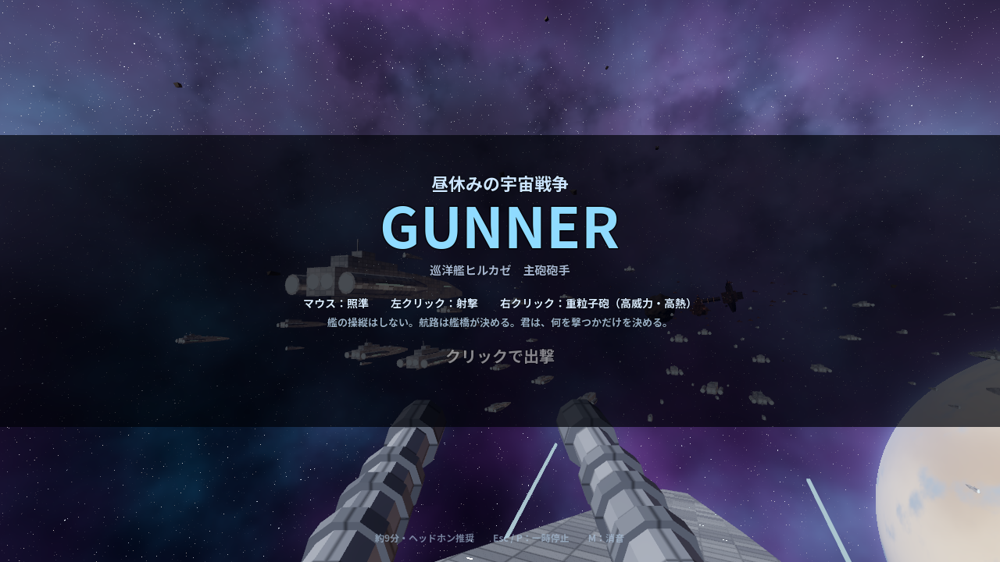
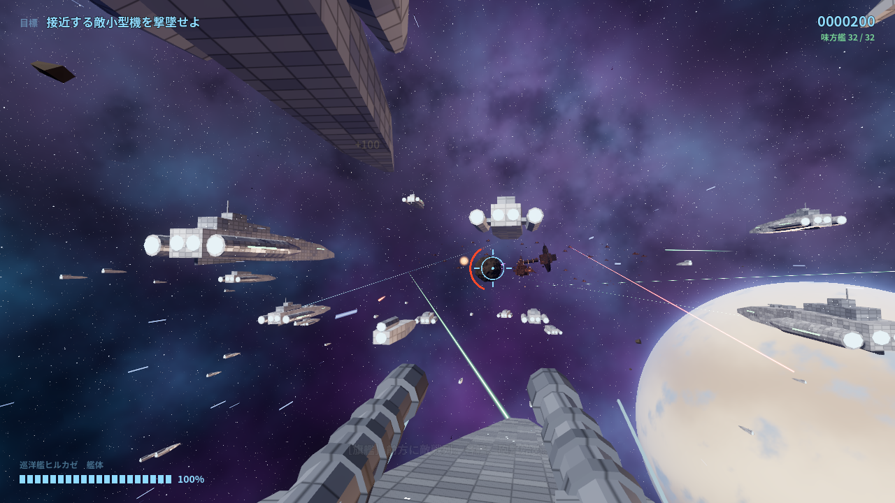
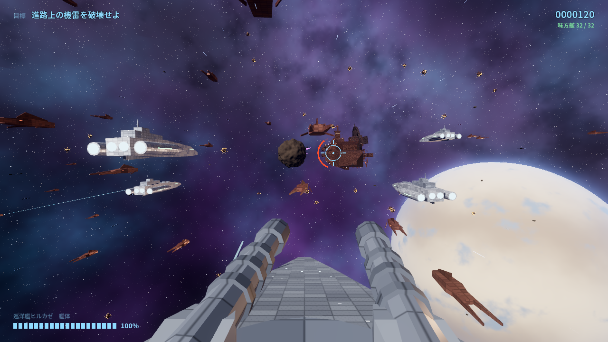
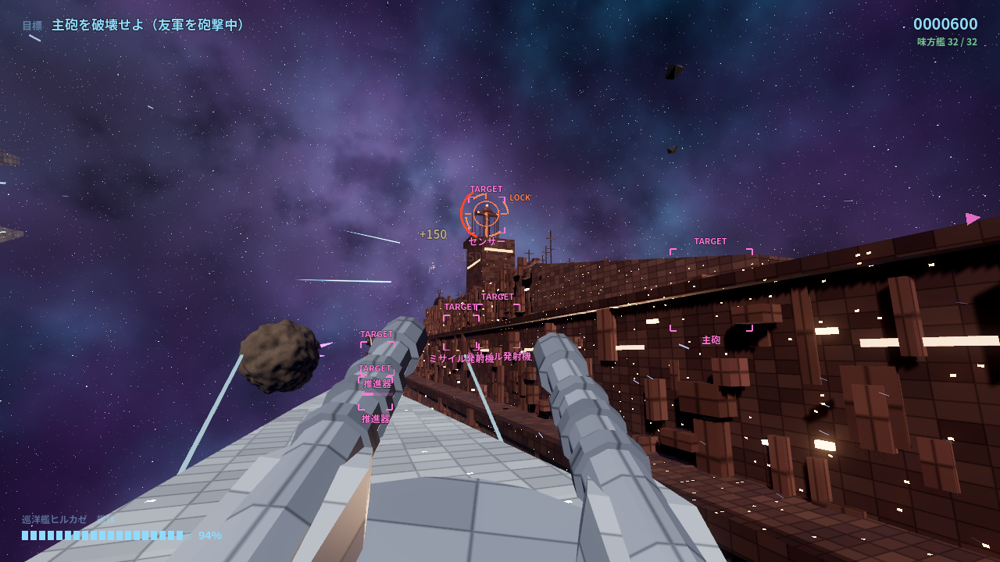
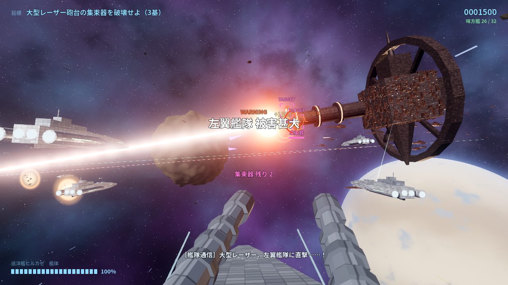
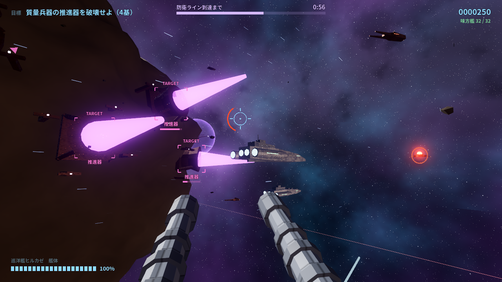
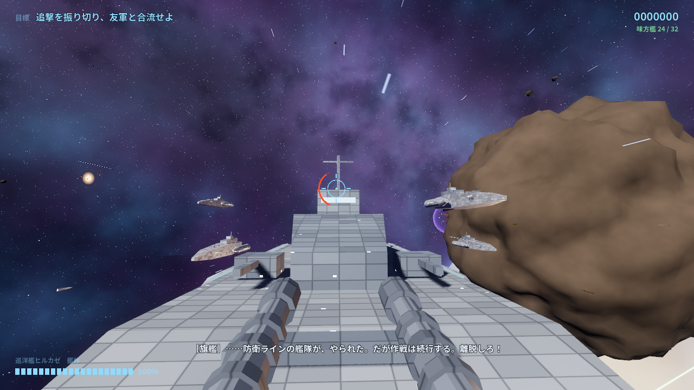

# 昼休みの宇宙戦争：GUNNER

▶ **遊ぶ: https://katomi95.github.io/hiruyasumi-gunner/**

（PCブラウザ推奨・マウス必須・ヘッドホン推奨。初回は約40MBの読み込みがあります）

「昼休みの宇宙戦争」と同じ世界の 3D ガンナー型シューティング（Godot 4.6）。
艦隊全体ではなく、巡洋艦ヒルカゼの**主砲砲手**として一つの戦場に放り込まれる。



## 操作

| 操作 | 入力 |
| --- | --- |
| 照準 | マウス |
| 射撃 | 左クリック（押しっぱなしで連射。撃ち続けるとオーバーヒート） |
| 重粒子砲 | 右クリック（高威力。一発で大きく熱を持つ） |
| 一時停止 | Esc / P |
| 消音 | M |

無線のセリフは英語で読み上げる（字幕は日本語、その下に英語）。音声は **AI による合成音声**（Azure AI Speech）。

艦の操縦はない。航路・速度・回避はすべて艦橋が決める。プレイヤーが考えるのは
「どこへ行くか」ではなく「今、何を撃つべきか」。

## シリーズとの違い

2D 版は戦場全体を見て、どこで戦うかを判断するゲーム。
GUNNER は戦場の一部分へ放り込まれ、今この瞬間に何を撃つかを判断するゲーム。
配色はシリーズと共通（自艦隊＝水色 / 友軍＝緑 / 敵＝赤 / 砲台・質量兵器＝紫 / TARGET＝桃 / レーザー警告＝橙）。

## ステージ（一本・約9分）

| # | 場面 | 内容 |
| --- | --- | --- |
| 1 | 艦隊進撃 | 味方艦隊の中を進む。遠くで艦隊戦。敵小型機とミサイルで基本射撃を覚える |
| 2 | 敵戦列突入 | 攻撃艇が居座って撃ってくる。右舷の敵巡洋艦の砲台を潰さないと友軍が撃たれる |
| 3 | 機雷帯 | 進路上（橙）の機雷だけ撃つ。黄は護衛艦の進路上。撃ち漏らすと護衛艦が触雷する |
| ≫ | 跳躍 | 艦隊ごと長距離跳躍。星が光の筋に伸び、光のトンネルを抜けて別の宙域へ（空の惑星・星雲も変わる） |
| 4 | 巨大艦接近 | 全長2kmの敵戦艦の舷側をかすめて飛ぶ。砲台・主砲・発射機・センサー・推進器 |
| 5 | 巨大レーザー | 要塞の大型レーザー砲台が充填。集束器三基を壊せば阻止。間に合わなければ左翼艦隊が薙ぎ払われる（続行可）。続けて副砲の掃射を自艦が潜って回避 |
| ≫ | 跳躍 | 要塞宙域から質量兵器の航路へ二度目の跳躍 |
| 6 | 質量兵器 | 防衛ラインへ向かう質量兵器の周りを半周。推進器 → 制御装置（シールド）→ 爆破点 の順に破壊 |
| 7 | 離脱 | 砲座が後方へ旋回。追撃機とミサイルを落とし、友軍本隊と合流 |

| 艦隊進撃 | 機雷帯 |
| --- | --- |
|  |  |
| **巨大艦接近** | **巨大レーザー** |
|  |  |
| **質量兵器** | **離脱（後方射撃）** |
|  |  |

要塞・大型レーザー砲台・敵戦艦・質量兵器は、それぞれの場面になってから現れる（SCENE 2 の敵巡洋艦は跳躍して現れる）。

自艦は耐久 100。場面が変わるたびに応急修理（+15）。0 で撃沈。
結果画面で撃破数・ミサイル迎撃・命中率・味方艦残存数などを表示する。

## 構成

`scenes/main.tscn`

```
Main
├─ World            背景（星・星雲・惑星）・恒星光・宇宙塵・漂う残骸
├─ RailPath         Path3D。時刻つきの位置キーから Curve3D を組む
│  ├─ Follow        PathFollow3D（時刻で進む）
│  │  └─ ShipRig    自艦（旋回で傾く）
│  │     └─ PlayerGun   砲座。照準位置へ砲身が追従
│  └─ CamRig / Camera  砲座カメラ（視線キーで向きが決まる）
├─ EnemyManager     敵の出現・行動・当たり判定・敵弾
├─ AllyManager      護衛艦・遠景の艦隊（MultiMesh）・艦隊戦の演出・友軍戦闘機
├─ MissionManager   タイムライン・場面・大型レーザー・質量兵器
├─ EffectsManager   爆発・ビーム・火花・閃光（すべてプール）
├─ HUD              照準・耐久・目標・必要な時だけのゲージと TARGET
└─ Audio
```

- `scripts/models.gd` … 艦艇・兵装のメッシュを手続き的に組み立てる（外部モデル不使用）
- `scripts/setpieces.gd` … 敵巡洋艦・敵戦艦・要塞と大型レーザー砲台・質量兵器
- `scripts/target.gd` … 撃てる対象（敵機・ミサイル・機雷・砲台・部位）
- `shaders/` … 装甲板（三面投影）・ビーム・空・宇宙塵・残骸・岩・シールド
- `tools/gen_audio.py` … 効果音の合成（`py -3.10 tools/gen_audio.py`）
- `tools/voice_lines.tsv` … 無線のセリフ（話者・日本語字幕・英語）。ここを直して下の二つを実行すると声が作り直される
- `tools/gen_voice_azure.py` … Azure AI Speech（有料 S0・既定のニューラル音声）で読み上げて `tools/voice_raw/` へ。キーは環境変数 `AZURE_SPEECH_KEY` / `AZURE_SPEECH_REGION` から読む
- `tools/gen_voice.ps1` … Windows 内蔵の英語音声で読み上げる版（手元での試聴用。**公開物には使わない**：再配布の許可が明確でないため）
- `tools/gen_voice_fx.py` … 無線・艦内通話らしい音質にして `audio/voice/` へ。`scripts/voice_lines.gd` も生成
- `tools/make_font.py` … 使用文字だけの Noto Sans JP Bold を作る。**画面の文言（漢字）を足したら必ず実行する**（入っていない字は化ける）
- `docs/` … Web 書き出し（GitHub Pages 公開用）

### Web 版について

Web 書き出しは Compatibility レンダラー。背景の艦隊は MultiMesh の簡略モデル、
効果はプール、機雷や残骸の数は Web では減らしている。星雲は Web で暗く出るので明るさを補正している。

## 検証用の引数

```
godot --path . -- --autoplay --fast=4 --quit          # 自動砲手で最後まで。結果と被弾の内訳を表示
godot --path . -- --start=276                          # SCENE 5 から
godot --path . -- --autoplay --nofire --fast=8 --quit  # 撃たなかった場合の被害
godot --path . -- --shots=<dir> --at=-1,30,230         # その時刻を撮影（-1 はタイトル）
```

## クレジット

- 効果音：すべて `tools/gen_audio.py` によるプログラム合成
- 無線の英語音声：[Azure AI Speech](https://azure.microsoft.com/products/ai-services/text-to-speech)（有料プラン）の既定のニューラル音声で生成した **AI 合成音声**を加工（Davis・Guy・Tony・Aria・Jenny）
- フォント：Noto Sans JP（SIL Open Font License 1.1、`fonts/OFL.txt`）。使用文字のみにサブセット化
- エンジン：[Godot Engine](https://godotengine.org/) 4.6
